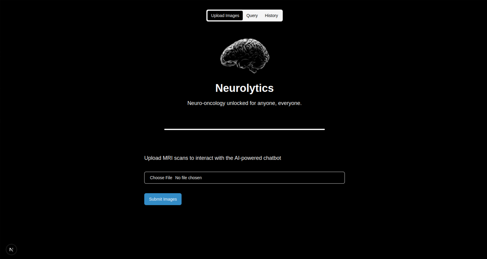
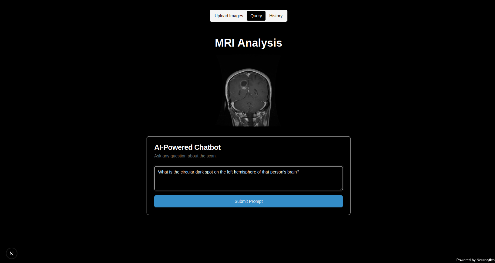
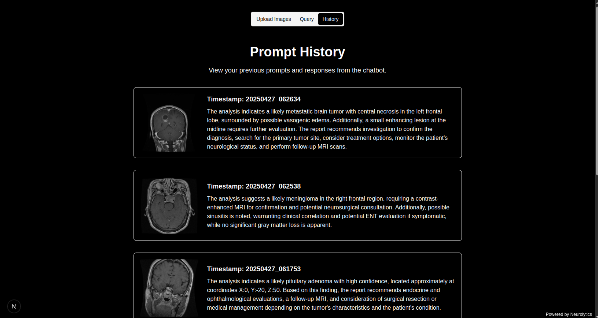

# NeuroAccess – AI‑Powered Neuro‑Oncology Assistant  
<sup><sub>Winner – **HackDartmouth 2025: Healthcare Track**</sub></sup>

<p align="center">
  
</p>

---

## Overview

More than **50 million** people worldwide need MRI interpretation every year, yet neuroradiologists are scarce and expensive. **NeuroAccess** lets anyone upload a brain MRI, receive an AI‑driven diagnostic summary, and ask follow‑up questions in natural language – all inside a single web page.

We combine **Next.js**, **Google Gemini Vision**, and **AWS S3** to deliver expert‑level insights in seconds, freeing clinicians to focus on critical cases and empowering students to learn neuro‑oncology hands‑on.

<p align="center">
  
  
</p>

---

## What It Does

| Step | Action | Tech |
|------|--------|------|
| 1 | **Upload** any T1/T2 slice (JPEG/PNG) | Next.js file input |
| 2 | **Instant Analysis** of tumor type, grey‑matter loss, abnormalities | Gemini Vision 2.0 |
| 3 | **One‑Click Chat** – ask anything about the scan with grounded answers | Gemini LLM + JSON context |
| 4 | **Auto‑Archival** – each run saved to S3 and visible in **History** tab | AWS S3 |

---

## Key Innovations

- **Context‑Grounded Chat** – every reply cites the exact JSON analysis, avoiding hallucinations.
- **Timestamp Keys** – frontend & backend stay perfectly in‑sync even with concurrent uploads.
- **Zero‑Sound UX** – purely visual + textual; ideal for quiet clinical settings.
- **Plug‑and‑Play Cloud** – no GPUs needed; Gemini handles all computation.

---

## System Architecture

```
User ─▶ Next.js ──▶ Flask API ──▶ Gemini Vision
        │  ▲          │
        │  │          └──▶ AWS S3  (images + JSON + summary)
        ▼  │
    Chat UI ◀──────────┘
```

1. **/analyze_mri** → uploads image, gets JSON analysis, stores to `saved/<timestamp>/`.
2. **/chat** → receives `{ prompt, timestamp }`, loads matching JSON, returns answer.
3. **/history** → lists past runs with thumbnails & summaries.

---

## Built With

- **Frontend** – `Next.js 14`, `TypeScript`, `TailwindCSS`, `shadcn/ui`
- **Backend** – `Python 3.10`, `Flask`, `google-generativeai`, `boto3`
- **Cloud** – `AWS S3`, `GitHub Actions` (CI/CD)

---

## Running Locally

```bash
# 1 Clone
$ git clone https://github.com/your‑org/neuroaccess.git && cd neuroaccess

# 2 Backend
$ cd backend && python -m venv .venv && source .venv/bin/activate
$ pip install -r requirements.txt
$ cp .env.local.example .env.local  # add your keys
$ python app.py            # http://localhost:5000

# 3 Frontend
$ cd ../frontend && npm install
$ npm run dev -p 3000       # http://localhost:3000
```

---

## Folder Structure

```
backend/
  app.py           # Flask server
  requirements.txt
frontend/
  src/app/         # Next.js pages
  tailwind.config.ts
README.md
```

---

## API Reference

| Verb | Endpoint | Payload | Returns |
|------|----------|---------|---------|
| POST | `/analyze_mri` | form‑data `file` | `{ timestamp, image_url, … }` |
| POST | `/chat` | `{ prompt, timestamp }` | `{ response }` |
| GET  | `/history` | – | `[{ timestamp, mri_url, summary }]` |

---

## Future Work

- Segmentation overlay masks
- DICOM upload + series handling
- HIPAA‑grade audit logging

---

## Check Us Out

- Demo Video ▶ **coming soon**
- Devpost 📝 **coming soon**
